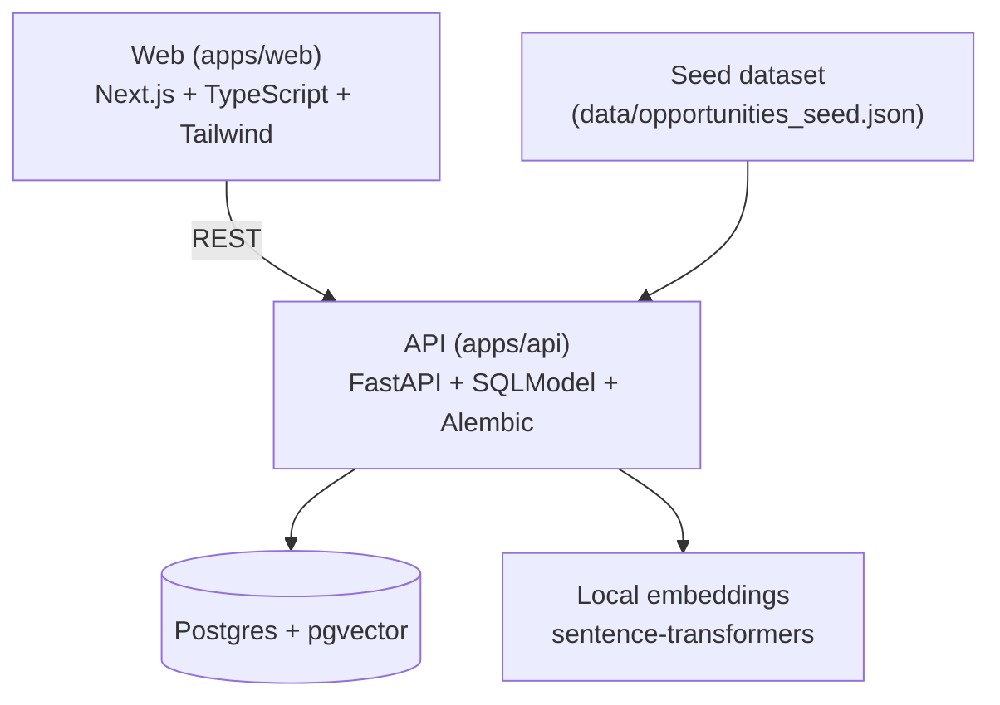

# VioletFund

**Tagline:** Verified funding copilot for female founders (grants + accelerators + programs) with explainable matching, application tracking, and human-in-the-loop labeling that measurably improves results.

## Quickstart
For first-time setup (Docker, Git, PATH fixes), see **[getting-started.md](./getting-started.md)**.

#### Otherwise:
```bash
cp .env.example .env
make dev
```

Then open:
- Web app: http://localhost:3000
- API docs: http://localhost:8000/docs

### Common commands

```bash
make ingest   # re-ingest bundled dataset
make scrape   # optional scrape demo sources
make test     # api tests + web lint/build
make fmt      # format backend + web lint --fix
```

## Architecture



## Product walkthrough (3-minute demo script)

1. **Landing page**
   - Narration: "Paste a grant link. We extract eligibility, highlight evidence, and generate a to-do plan."
   - Click: **Start your funding plan** or go to **Copilot**.

2. **Copilot (wow moment)**
   - Paste a funding URL (or raw text) and click **Analyze**.
   - Narration: "We extract structured fields, show evidence snippets, and run trust checks."
   - Click **Generate plan** to reveal the staged checklist + outreach drafts.
   - Click **Add to tracker**.

3. **Opportunity detail**
   - Click **View detail** from Copilot or open any opportunity.
   - Click **Verify** to refresh checks.
   - Click **Improve** to open the plan + drafts.
   - Narration: "What the AI did is fully transparent, and corrections update evidence."

4. **Application tracker**
   - Open **Tracker**.
   - Show tasks and due dates created by Copilot.
   - Drag the card across stages.
   - Narration: "Your pipeline moves across Saved → Planned → In Progress, etc."

5. **Verify & Improve**
   - Open **Verify & Improve**.
   - Correct missing fields, submit.
   - Narration: "We recompute embeddings and show the rank improvement immediately."

## How labeling improves ranking

When a user edits fields like eligibility, description, or raw text, VioletFund re-embeds the opportunity and re-ranks it for the active founder profile. The UI displays the before/after position (rank) so the user can see the measurable lift caused by their corrections.

## Screenshots

> Replace the placeholders below with real screenshots from your demo.

- Landing page: `docs/screenshots/landing.png`
- Dashboard: `docs/screenshots/dashboard.png`
- Tracker: `docs/screenshots/tracker.png`
- Labeling UI: `docs/screenshots/labeling.png`

## Dataset

`data/opportunities_seed.json` includes 250+ opportunities with real source URLs and short raw text excerpts to keep the demo fully offline-ready.

## Tech stack

- **Frontend:** Next.js + TypeScript + Tailwind
- **Backend:** FastAPI + SQLModel + Alembic
- **Database:** Postgres + pgvector
- **Embeddings:** sentence-transformers (local)

## Environment

See `.env.example` for defaults. No paid API keys are required; all embeddings run locally.
